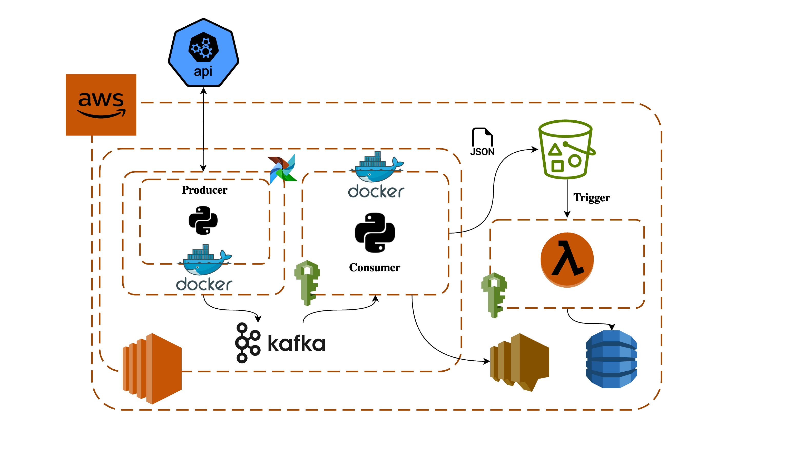

# Real Time Crypto Data Ingestion Pipeline
========================================

This project provides a real-time data pipeline for cryptocurrency data, built using Apache Kafka, Docker, AWS services, and DynamoDB. It enables real-time ingestion, processing, and storage of crypto data with Python scripts running in Docker containers. Airflow is used to automate the producer job every 5 minutes.

Architecture Overview
---------------------


### Components:

1.  **API Data Source**:

    -   Fetches cryptocurrency data from [livecoinwatch](https://www.livecoinwatch.com/) public API.
2.  **Airflow DAG**:

    -   Automates the Kafka producer Docker container to run every 5 minutes, triggering the ingestion of real-time data from the API.
3.  **Kafka Producer**:

    -   A Python-based producer, running in a Docker container, fetches data from the API and publishes it to Kafka topics.
4.  **Kafka Consumer**:

    -   A Python-based consumer (also running in a Docker container) listens to Kafka topics, processes the data, and writes it as JSON files to an S3 bucket.
5.  **AWS S3**:

    -   Stores the processed data in JSON format.
6.  **AWS Lambda Trigger**:

    -   Automatically triggers upon the addition of new data in S3.
7.  **AWS Lambda Function**:

    -   Processes the data and stores it in DynamoDB for further querying.
8.  **DynamoDB**:

    -   Provides scalable, serverless data storage and querying for processed crypto data.
9.  **AWS SNS**:

    -   Provides alerts and detailed error during the processing of messages from the producer.

Features
--------

-   **Real-Time Data Pipeline**: Continuous streaming of cryptocurrency data using Kafka.
-   **Dockerized Components**: Producer and consumer both run as Docker containers for portability and scalability.
-   **Automated Workflow**: Airflow DAG automates the producer run every 5 minutes to ensure continuous data ingestion.
-   **Event-Driven Automation**: AWS Lambda triggers and processes new data, storing it in DynamoDB.

Prerequisites
-------------

-   **Apache Kafka**: Installed and running.
-   **Docker**: Installed to run the producer and consumer services.
-   **Airflow**: Set up to automate the producer job every 5 minutes.
-   **AWS Account**: With access to S3, Lambda, and DynamoDB.
-   **Python 3.11**: Used for writing the Kafka producers and consumers.

Setup and Installation
----------------------

1.  **Clone the Repository**:

    bash

    ```
    git clone https://github.com/ud17/kafka-crypto-data-pipeline.git
    cd kafka-crypto-data-pipeline
    ```

2.  **Install Dependencies**: Install the required Python libraries:

    bash

    `pip install -r lib.txt`

3.  **Set Up Docker**: Ensure Docker is installed, and pull the Docker images for the producer and consumer. Run them using Docker commands:

    bash

    ```docker build -t producer_image:v1 .
    docker build -t consumer_image:v1 .
    docker run -d --name consumer_container consumer_image:v1
    ```

    Ensure `producer` image name matches the one referenced in your Airflow DAG.

4.  **Set Up Airflow**: Define a DAG in Airflow that schedules the producer to run every 5 minutes:

    python

    ```
    from airflow import DAG
    from airflow.operators.docker_operator import DockerOperator
    from datetime import datetime, timedelta

    dag = DAG('crypto_pipeline', default_args={'start_date': datetime(2024, 1, 1)}, schedule_interval='*/5 * * * *')

    t1 = DockerOperator(
        task_id='run_producer',
        image='producer_image:v1',
        dag=dag
    )
    ```

5.  **Run the Pipeline**: Start the Kafka producer and consumer services by running the Docker containers:

    bash

    `docker start consumer_container`

Usage
-----

-   **Producer**: Collects real-time cryptocurrency data from the API and sends it to Kafka topics.
-   **Airflow**: Automates the producer to run every 5 minutes.
-   **Consumer**: Listens to the Kafka topics, processes the data, and stores it as JSON files in S3.
-   **Lambda**: Gets triggered when new data is added to S3, processes it, and stores it in DynamoDB.

Deployment
----------

To deploy this pipeline in a production environment:

1.  Set up a Kafka broker. Ensure both Zookeeper and Kafka server are running.
2.  Deploy Docker containers for the producer and consumer on a container orchestration service such as AWS ECS or Kubernetes.
3.  Ensure Airflow is deployed and configured to manage the producer jobs.
4.  Ensure AWS services (S3, Lambda, DynamoDB) are configured correctly.

Error Handling
----------
The Kafka consumer is equipped with error handling mechanisms. If any error occurs during the processing of messages from the producer, the consumer sends a detailed error message to an AWS SNS Topic. This SNS Topic is then subscribed to email to alert administrators or trigger automated responses to handle the error.